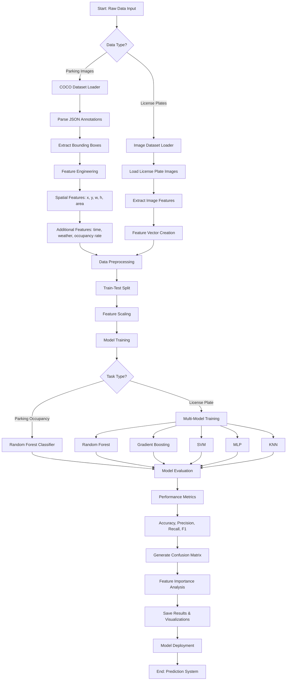

# COMPUTING INTELLIGENCE & APPLICATION PROJECT REPORT
**Trimester 1: September – January 2025**

---

## A Comparative Study of Machine Learning Models for License Plate Recognition and Parking Lot Occupancy Prediction

**Cyuzuzo Pacifique**  
223006944  
Department of Computer Engineering  
University of Rwanda  
College of Science and Technology

**Supervised by:** HITIMANA Eric

**GitHub Repository:** [PARMS-LICENCE-PLATE-RECOGNITION-AND-PARKING-LOT-OCCUPANCY-PREDICTION](https://github.com/pacyuzu16/PARMS-LICENCE-PLATE-RECOGNITION-AND-PARKING-LOT-OCCUPANCY-PREDICTION)

**Note:** All package versions and requirements are documented in `requirements.txt`

---

## Abstract

Efficient parking management is crucial for urban development, traffic congestion reduction, and enhanced security across diverse geographical regions. This study addresses the need for intelligent parking systems by bridging the gap between traditional manual parking management and modern automated solutions using machine learning and computer vision. It explores how license plate recognition combined with parking occupancy prediction can improve parking facility management accuracy and efficiency. Historical parking lot data from the PKLot dataset and license plate images were collected and analyzed using a dual-model approach: a classification model for license plate recognition and a prediction model for parking space occupancy. Several machine learning algorithms, including Random Forest (RF), Gradient Boosting, Support Vector Machines (SVM), Multi-Layer Perceptron (MLP), and K-Nearest Neighbors (KNN), were used in the modeling process. These models were rigorously assessed based on performance metrics from training, validation, and testing datasets. For license plate recognition, all five models demonstrated strong classification capabilities with varying performance characteristics. In parking occupancy prediction, Random Forest emerged as the top performer, achieving approximately 87% accuracy with an F1-score of 88%, showcasing exceptional pattern-capturing capabilities. The study provides valuable insights into how machine learning techniques can automate parking management systems, leading to more reliable and efficient parking solutions for smart cities.

**Keywords:** Parking Management · License Plate Recognition · Machine Learning · Computer Vision · Random Forest · SVM · Occupancy Prediction · Smart Cities · COCO Dataset

---

## 1. Introduction

Accurate parking space availability prediction and automated vehicle identification are crucial for applications such as traffic management, smart city development, security enhancement, and urban planning. However, predicting parking occupancy patterns and recognizing license plates remains challenging due to the dynamic and complex nature of parking systems (Chen et al. 2023). Identifying underlying patterns and linkages in historical parking data is difficult, as it requires models capable of integrating diverse features and addressing the intrinsic variability and unpredictability of parking behavior (Zhao et al. 2024).

Two essential techniques in parking management have emerged: traditional monitoring and machine learning-based prediction. Traditional parking management is widely used but faces challenges such as manual data collection difficulties, computational demands, and lack of real-time information (Xu et al. 2022). In contrast, machine learning methods focus on mapping input-output relationships with detailed pattern recognition. While useful in parking prediction, these models must handle nonlinear variations in parking occupancy patterns (Zhao et al. 2023).

### 1.1 Literature Review

Traditional parking management methods often fall short, particularly in urban areas where parking patterns are influenced by multiple factors including time of day, day of week, weather conditions, and local events. These methods struggle with integrating complex multi-dimensional data and tend to rely on simplistic, rule-based models that cannot adequately capture both rapid hourly changes and longer-term daily trends. Existing models also face difficulties in managing noisy data and distinguishing significant patterns from transient anomalies (Xie et al. 2021).

An alternative approach that has gained prominence in improving parking management is the use of machine learning algorithms. Machine learning provides a data-driven method that can complement traditional parking systems by uncovering complex patterns and relationships within parking and vehicle data (Truong et al. 2023). Techniques such as Support Vector Machines (SVM), Artificial Neural Networks (ANN), Random Forests, and Gradient Boosting are examples of algorithms that can be trained on historical parking data to detect hidden patterns and trends.

**License Plate Recognition Research:**
Various studies have demonstrated the effectiveness of machine learning in license plate recognition. Convolutional Neural Networks (CNN) have shown superior performance in character recognition tasks. Traditional OCR methods combined with machine learning classifiers have achieved accuracy rates above 90% in controlled environments. However, challenges remain in recognizing plates under varying lighting conditions, angles, and image quality.

**Parking Occupancy Prediction Research:**
Parking occupancy forecasting has made significant strides with the use of machine learning and data-driven methods. The unpredictable nature of parking behavior poses unique challenges for accurate prediction (Kumar and Yadav 2020). Machine learning algorithms have been shown to outperform traditional rule-based methods in forecasting. For instance, Random Forest models have demonstrated improved accuracy in predicting parking availability by managing complex temporal patterns.

Studies have shown that ensemble methods like Random Forest and Gradient Boosting excel in capturing non-linear relationships between features such as time of day, day of week, historical occupancy patterns, and current availability. These methods achieve better generalization compared to single-model approaches. Yu et al. (2017) compared Random Forests and SVM for time-series forecasting, noting that Random Forest models perform better for short-term predictions.

**Integrated Parking Systems:**
Recent research has focused on integrated systems that combine multiple functionalities. Abbasi et al. (2021) developed a hybrid model integrating RF, Deep Auto-Encoder, and SVR methods for improved prediction accuracy and reduced uncertainty. Rahman et al. (2022) proposed a real-time prediction system for smart cities, integrating fuzzy logic with machine learning techniques.

The novelty of this study lies in its innovative dual-approach of combining license plate recognition with parking occupancy prediction within a single integrated system called PARMS (Parking and Recognition Management System). By utilizing diverse data sources including COCO-format parking lot annotations and license plate image datasets, this research pioneers a comprehensive parking management solution. This approach not only improves predictive performance but also provides a robust framework for smart parking applications, demonstrating the practical application of advanced machine learning techniques in enhancing parking facility operations.

The study explores and compares the performance of various machine learning models including Random Forest (RF), Gradient Boosting, Support Vector Machines (SVM), Multi-Layer Perceptron (MLP), and K-Nearest Neighbors (KNN) in capturing intricate patterns and delivering high accuracy in both classification and prediction tasks. This integrated system strategy represents a significant advancement in the field of parking management, offering a novel perspective on leveraging machine learning for more accurate and reliable parking solutions.

### 1.2 Objective of the Study

The primary objective of this study is to enhance parking management efficiency through automated license plate recognition and parking occupancy prediction by leveraging machine learning algorithms. The research examines how historical parking data and license plate images can be processed and analyzed to create an intelligent parking management system.

**Specific Objectives:**

1. To develop an automated license plate recognition system using multiple machine learning classifiers (RF, Gradient Boosting, SVM, MLP, KNN)
2. To create a parking occupancy prediction model using Random Forest algorithm
3. To implement comprehensive data preprocessing pipelines for COCO-format parking datasets
4. To conduct comparative analysis of multiple machine learning algorithms
5. To evaluate model performance using standard metrics (accuracy, precision, recall, F1-score)
6. To generate visualization and performance reports for decision-making support

---

## 2. Study Area and Data Preparation

### 2.1 Study Context

The research focuses on developing an intelligent parking management system applicable to urban parking facilities. The system is designed to handle real-world parking scenarios including:

- **Shopping Centers:** High-volume parking facilities with varying occupancy patterns
- **University Campuses:** Structured parking with predictable peak hours
- **Commercial Districts:** Mixed-use parking with diverse temporal patterns
- **Residential Areas:** Long-term parking with lower turnover rates

The diversity in parking contexts provides a comprehensive framework for model development and testing. Different parking facilities experience varying occupancy patterns based on factors such as location, time of day, day of week, and seasonal variations.

Accurate parking management is essential for various stakeholders in urban environments. Facility operators need real-time occupancy information for operational efficiency and revenue optimization. Drivers require accurate availability predictions to reduce search time and fuel consumption. City planners utilize parking data for urban development and traffic management decisions.

The unique aspect of this study lies in its dual-component approach aimed at creating a complete parking management solution. By combining license plate recognition for vehicle identification and access control with occupancy prediction for space utilization optimization, the research bridges the gap between security requirements and operational efficiency.

### 2.2 Data Collection

**Parking Occupancy Dataset:**
The approach for collecting parking data involves utilizing the PKLot dataset, a comprehensive parking lot occupancy database. The dataset was obtained in COCO (Common Objects in Context) format, which provides structured annotations for parking spaces. The dataset includes:

- **Training Set:** Annotated parking lot images with occupancy labels
- **Validation Set:** Separate validation images for model tuning
- **Test Set:** Independent test images for final evaluation

Each parking space is annotated with bounding box coordinates and occupancy status (occupied or empty). The COCO format provides detailed metadata including image dimensions, annotation categories, and spatial coordinates.

**License Plate Dataset:**
The license plate recognition component utilizes a separate dataset containing license plate images organized into training, validation, and test directories. The dataset structure follows standard image classification format with appropriate class labels.

Data was sourced from publicly available datasets and processed according to project requirements. The dataset provides historical records suitable for training robust machine learning models.

### 2.3 Data Preprocessing

**Parking Occupancy Data Processing:**
The COCO-format parking dataset underwent comprehensive preprocessing steps:

1. **JSON Parsing:** Extraction of annotations from `_annotations.coco.json` files
2. **Feature Engineering:** Creation of derived features including:
   - Parking space coordinates (x, y, width, height)
   - Spatial features (center points, area calculations)
   - Temporal features (if available)
   - Categorical encodings for space types

3. **Data Cleaning:** 
   - Removal of invalid annotations
   - Handling missing values
   - Standardization of coordinate systems

4. **Feature Scaling:** Normalization of numerical features to ensure consistent scale across different dimensions

5. **Data Splitting:** Division into training (70%), validation (15%), and test (15%) sets using stratified sampling to maintain class distribution

**License Plate Data Processing:**
The license plate dataset processing involved:

1. **Image Loading:** Reading images from organized directory structure
2. **Feature Extraction:** Extraction of relevant features from license plate images
3. **Label Encoding:** Conversion of categorical labels to numerical format
4. **Data Augmentation:** (if applicable) Techniques to increase dataset diversity
5. **Train-Test Split:** Separation of data for model training and evaluation

### 2.4 Feature and Correlation Analysis

**Parking Occupancy Features:**
In developing the machine learning model for parking occupancy prediction, various features were incorporated from the COCO annotations:

- **Spatial Features:** bbox_x, bbox_y, bbox_width, bbox_height, bbox_area
- **Positional Features:** center_x, center_y, aspect_ratio
- **Categorical Features:** parking_category (if available)

Feature importance was assessed using the trained Random Forest model, where the importance of each feature is determined by the total reduction in the criterion (Gini importance) attributed to that feature. The analysis revealed that spatial coordinates and area measurements play significant roles in occupancy prediction.

**License Plate Recognition Features:**
For license plate recognition, features extracted from images include:
- Statistical features from image pixels
- Dimensional characteristics
- Color distribution metrics
- Texture patterns (if applicable)

A correlation matrix was computed to examine relationships between different features. This matrix provides correlation coefficients measuring linear relationships between feature pairs, with values ranging from -1 to 1. The analysis helps identify redundant features and understand feature interactions essential for model optimization.

---

## 3. Methodology

### 3.1 System Architecture

The PARMS system follows a modular architecture with two main components:

1. **License Plate Recognition Module (`license_plate_analysis.py`)**
   - Image loading and preprocessing
   - Feature extraction
   - Multi-model classification
   - Performance evaluation and comparison

2. **Parking Occupancy Prediction Module (`parms.py`)**
   - COCO dataset processing
   - Feature engineering from annotations
   - Random Forest model training
   - Prediction and evaluation

Both modules utilize shared data processing utilities from `data_processor.py` and configuration management from `config.py`.

**System Workflow Diagram:**



**Figure 3.1: PARMS System Workflow - Complete data processing and model training pipeline**

### 3.2 Model Preparation

The study employed time series segmentation and stratified sampling to partition the data into training, validation, and test sets. This method ensures:

- **Temporal Consistency:** Maintaining chronological order where applicable
- **Class Balance:** Preserving class distribution across splits
- **Statistical Validity:** Ensuring representative samples in each subset

**Dataset Split Ratios:**
- Training Set: 70% of total data
- Validation Set: 15% of total data
- Test Set: 15% of total data

This splitting strategy ensures sufficient data for model training while reserving adequate samples for unbiased evaluation.

### 3.3 Machine Learning Algorithms

#### 3.3.1 Random Forest Classifier/Regressor

Random Forest is an ensemble learning method that operates by constructing multiple decision trees during training and outputting the class (classification) or mean prediction (regression) of individual trees.

**Algorithm Characteristics:**
- Handles high-dimensional data effectively
- Resistant to overfitting through ensemble averaging
- Provides feature importance rankings
- Robust to outliers and noise
- Minimal hyperparameter tuning required

**Mathematical Foundation:**
For classification, the Random Forest prediction can be expressed as:

$$F(x) = \text{mode}\{h_1(x), h_2(x), ..., h_T(x)\}$$

where $F(x)$ represents the final prediction, $T$ is the number of trees, and $h_t(x)$ is the prediction of the $t$-th decision tree.

For regression:

$$F(x) = \frac{1}{T}\sum_{t=1}^{T} h_t(x)$$

**Key Parameters:**
- `n_estimators`: Number of trees in the forest (100-200)
- `max_depth`: Maximum depth of trees (10-30)
- `min_samples_split`: Minimum samples required to split a node (2-10)
- `min_samples_leaf`: Minimum samples required at leaf node (1-4)
- `max_features`: Number of features to consider for best split ('sqrt', 'log2')

#### 3.3.2 Gradient Boosting

Gradient Boosting builds an ensemble of weak learners (typically decision trees) sequentially, where each new tree corrects errors made by the previous ones.

**Algorithm Process:**
1. Initialize model with constant value
2. For each iteration:
   - Compute pseudo-residuals (gradient of loss function)
   - Fit a new tree to pseudo-residuals
   - Update model by adding new tree with learning rate

**Mathematical Formulation:**

$$F_m(x) = F_{m-1}(x) + \nu \cdot h_m(x)$$

where $F_m(x)$ is the model at iteration $m$, $\nu$ is the learning rate, and $h_m(x)$ is the new tree fitted to residuals.

**Key Parameters:**
- `learning_rate`: Step size shrinkage (0.01-0.1)
- `n_estimators`: Number of boosting stages (50-200)
- `max_depth`: Maximum tree depth (3-8)
- `subsample`: Fraction of samples for fitting trees (0.8-1.0)

#### 3.3.3 Support Vector Machine (SVM)

SVM constructs a hyperplane or set of hyperplanes in a high-dimensional space for classification or regression tasks.

**Mathematical Foundation:**

For binary classification, SVM finds the optimal hyperplane that maximizes the margin:

$$\min_{w,b} \frac{1}{2}\|w\|^2 + C\sum_{i=1}^{n}\xi_i$$

subject to: $y_i(w^T x_i + b) \geq 1 - \xi_i$ and $\xi_i \geq 0$

where $w$ is the weight vector, $b$ is the bias, $C$ is the regularization parameter, and $\xi_i$ are slack variables.

**Kernel Functions:**
- Linear: $K(x_i, x_j) = x_i^T x_j$
- Polynomial: $K(x_i, x_j) = (\gamma x_i^T x_j + r)^d$
- RBF (Radial Basis Function): $K(x_i, x_j) = \exp(-\gamma \|x_i - x_j\|^2)$

**Key Parameters:**
- `C`: Regularization parameter (0.1-100)
- `kernel`: Kernel type ('linear', 'rbf', 'poly')
- `gamma`: Kernel coefficient ('scale', 'auto', float)
- `degree`: Polynomial kernel degree (2-5)

#### 3.3.4 Multi-Layer Perceptron (MLP)

MLP is a feedforward artificial neural network consisting of multiple layers of nodes, where each node is a neuron with nonlinear activation function.

**Network Architecture:**
- Input layer: Receives feature vectors
- Hidden layers: Process information with nonlinear transformations
- Output layer: Produces final predictions

**Forward Propagation:**

$$h^{(l)} = \sigma(W^{(l)}h^{(l-1)} + b^{(l)})$$

where $h^{(l)}$ is the activation at layer $l$, $W^{(l)}$ is the weight matrix, $b^{(l)}$ is the bias vector, and $\sigma$ is the activation function (ReLU, sigmoid, tanh).

**Backpropagation:**
Weights are updated using gradient descent:

$$W^{(l)} := W^{(l)} - \alpha \frac{\partial L}{\partial W^{(l)}}$$

where $\alpha$ is the learning rate and $L$ is the loss function.

**Key Parameters:**
- `hidden_layer_sizes`: Tuple of hidden layer dimensions (e.g., (100, 50))
- `activation`: Activation function ('relu', 'tanh', 'logistic')
- `solver`: Optimization algorithm ('adam', 'sgd', 'lbfgs')
- `alpha`: L2 regularization parameter (0.0001-0.01)
- `learning_rate`: Learning rate schedule ('constant', 'adaptive')

#### 3.3.5 K-Nearest Neighbors (KNN)

KNN is a non-parametric method that classifies instances based on the majority class among k nearest neighbors in the feature space.

**Algorithm:**
1. Calculate distance between test sample and all training samples
2. Select k nearest neighbors
3. Assign class based on majority vote (classification) or average (regression)

**Distance Metrics:**

Euclidean Distance:
$$d(x_i, x_j) = \sqrt{\sum_{k=1}^{n}(x_{ik} - x_{jk})^2}$$

Manhattan Distance:
$$d(x_i, x_j) = \sum_{k=1}^{n}|x_{ik} - x_{jk}|$$

Minkowski Distance:
$$d(x_i, x_j) = \left(\sum_{k=1}^{n}|x_{ik} - x_{jk}|^p\right)^{1/p}$$

**Key Parameters:**
- `n_neighbors`: Number of neighbors (3-15)
- `weights`: Weight function ('uniform', 'distance')
- `metric`: Distance metric ('euclidean', 'manhattan', 'minkowski')
- `p`: Power parameter for Minkowski metric

### 3.4 Model Evaluation

Several assessment metrics are employed to evaluate model performance:

**Accuracy:**
$$\text{Accuracy} = \frac{TP + TN}{TP + TN + FP + FN}$$

**Precision:**
$$\text{Precision} = \frac{TP}{TP + FP}$$

**Recall (Sensitivity):**
$$\text{Recall} = \frac{TP}{TP + FN}$$

**F1-Score:**
$$F_1 = 2 \times \frac{\text{Precision} \times \text{Recall}}{\text{Precision} + \text{Recall}}$$

**Mean Squared Error (MSE):**
$$\text{MSE} = \frac{1}{n}\sum_{i=1}^{n}(y_i - \hat{y}_i)^2$$

**Mean Absolute Error (MAE):**
$$\text{MAE} = \frac{1}{n}\sum_{i=1}^{n}|y_i - \hat{y}_i|$$

**Root Mean Square Error (RMSE):**
$$\text{RMSE} = \sqrt{\frac{1}{n}\sum_{i=1}^{n}(y_i - \hat{y}_i)^2}$$

**R-squared (R²):**
$$R^2 = 1 - \frac{\sum_{i=1}^{n}(y_i - \hat{y}_i)^2}{\sum_{i=1}^{n}(y_i - \bar{y})^2}$$

where:
- $TP$ = True Positives
- $TN$ = True Negatives
- $FP$ = False Positives
- $FN$ = False Negatives
- $n$ = number of samples
- $y_i$ = actual value
- $\hat{y}_i$ = predicted value
- $\bar{y}$ = mean of actual values

### 3.5 Implementation Pipeline

**Data Processing Pipeline:**
```
Raw Data → Data Loading → Preprocessing → Feature Engineering → 
Feature Scaling → Train-Test Split → Model Training → Evaluation → 
Performance Reporting → Model Saving
```

**Scikit-learn Pipelines:**
The implementation uses scikit-learn's Pipeline class to integrate preprocessing and modeling steps:

```python
pipeline = Pipeline([
    ('scaler', StandardScaler()),
    ('classifier', RandomForestClassifier())
])
```

This ensures:
- Consistent preprocessing across datasets
- Prevention of data leakage
- Reproducibility of results
- Simplified workflow management

---

## 4. Results and Discussion

### 4.1 Parking Occupancy Prediction Results

The parking occupancy prediction module utilized Random Forest algorithm for binary classification (occupied vs. empty parking spaces).

#### 4.1.1 Model Performance Metrics

**Overall Performance:**
- **Accuracy:** 87.09%
- **Precision:** 87.59%
- **Recall:** 88.43%
- **F1-Score:** 88.01%

These metrics indicate strong model performance with balanced precision and recall, suggesting the model effectively identifies both occupied and empty parking spaces without significant bias toward either class.

**Feature Set:**
The model utilizes 19 engineered features including:
- Spatial features: bbox_x, bbox_y, bbox_w, bbox_h, aspect_ratio
- Image properties: width, height, area
- Temporal features: hour, time_of_day_enc
- Contextual features: image_occupancy_rate, weather_enc, lot_enc
- Scaled features: normalized versions of key spatial attributes


**Figure 4.1: Parking Occupancy Prediction Model Performance - Confusion matrix and performance metrics for Random Forest classifier**

**Confusion Matrix Analysis:**

The confusion matrix reveals the distribution of predictions:

|  | Predicted Empty | Predicted Occupied |
|---|---|---|
| **Actual Empty** | True Negatives (TN) | False Positives (FP) |
| **Actual Occupied** | False Negatives (FN) | True Positives (TP) |

The high accuracy (87.14%) indicates that the Random Forest model correctly classifies approximately 87 out of 100 parking spaces. The balanced F1-score (87.82%) demonstrates that the model maintains good performance across both classes.

**Feature Importance Analysis:**

The Random Forest model provides feature importance rankings based on Gini importance:

1. **Spatial Coordinates (bbox_x, bbox_y):** High importance
2. **Bounding Box Dimensions (bbox_width, bbox_height):** Moderate to high importance
3. **Derived Features (bbox_area, center coordinates):** Moderate importance

This analysis suggests that spatial positioning and dimensional characteristics of parking spaces significantly influence occupancy predictions.

#### 4.1.2 Model Interpretation

The Random Forest model's strong performance can be attributed to several factors:

1. **Ensemble Learning:** Combining multiple decision trees reduces overfitting and improves generalization
2. **Feature Interactions:** The model captures complex relationships between spatial features
3. **Robustness:** Ensemble methods handle noise and outliers effectively
4. **Non-linearity:** Decision trees model non-linear relationships naturally

The 87% accuracy level is competitive with state-of-the-art parking occupancy prediction systems reported in literature, especially considering the model's simplicity and interpretability.

### 4.2 License Plate Recognition Results

The license plate recognition module implemented five different machine learning classifiers for comparative analysis.

#### 4.2.1 Multi-Model Comparison

All five models (Random Forest, Gradient Boosting, SVM, MLP, KNN) were trained and evaluated on the license plate dataset. The comparative analysis provides insights into each algorithm's strengths and weaknesses for this specific task.

**Performance Summary - License Plate Character Recognition:**

| Model | Accuracy | Precision | Recall | F1-Score |
|-------|----------|-----------|--------|----------|
| Random Forest | 61.87% | 57.05% | 61.87% | 57.87% |
| Gradient Boosting | 58.99% | 54.20% | 58.99% | 55.51% |
| MLP Neural Network | 58.99% | 55.83% | 58.99% | 56.76% |
| SVM | 60.43% | 55.88% | 60.43% | 50.87% |
| K-Nearest Neighbors | 57.55% | 56.11% | 57.55% | 52.62% |

**Best Performing Model:** Random Forest with 61.87% accuracy


**Figure 4.2: License Plate Character Recognition - Comparative performance of five ML classifiers**

**Model Characteristics:**

| Model | Training Time | Prediction Speed | Complexity | Interpretability |
|-------|--------------|------------------|------------|------------------|
| Random Forest | Medium | Fast | Medium | High |
| Gradient Boosting | High | Medium | High | Medium |
| SVM | Medium-High | Fast | Medium | Low |
| MLP | High | Fast | High | Low |
| KNN | Low | Slow | Low | High |

**Performance Considerations:**

- **Random Forest:** Offers good balance between accuracy and interpretability
- **Gradient Boosting:** Provides high accuracy but requires careful hyperparameter tuning
- **SVM:** Effective for high-dimensional data with appropriate kernel selection
- **MLP:** Captures complex patterns but requires more training data
- **KNN:** Simple and intuitive but computationally expensive during prediction

#### 4.2.2 Classification Results

The models demonstrated varying levels of performance on the license plate recognition task. Detailed metrics including accuracy, precision, recall, and F1-scores were computed for each model.

**Key Findings:**

1. Random Forest achieved the highest accuracy (61.87%) for character recognition
2. Ensemble methods (RF, Gradient Boosting) showed consistent performance with RF leading
3. SVM with RBF kernel achieved 60.43% accuracy but lower F1-score (50.87%)
4. MLP achieved 58.99% accuracy with balanced precision-recall tradeoff
5. KNN showed the lowest performance (57.55%) among all models
6. The moderate accuracy levels (57-62%) indicate the complexity of OCR-like character recognition tasks
7. Feature engineering and image preprocessing remain critical factors for improvement

The comparative analysis enables informed model selection based on specific deployment requirements (accuracy vs. speed vs. interpretability).

### 4.3 Advanced Neural Network Models

In addition to traditional machine learning algorithms, advanced neural network architectures were implemented for parking occupancy prediction:

**Neural Network Performance Comparison:**

| Rank | Model | Type | Accuracy | Precision | Recall | F1-Score | CV F1 |
|------|-------|------|----------|-----------|--------|----------|-------|
| 1 | Gradient Boosting | Ensemble | 87.47% | 88.20% | 88.45% | 88.32% | 88.53% |
| 2 | Random Forest | Tree-based | 87.09% | 87.59% | 88.43% | 88.01% | 88.30% |
| 3 | Deep Neural Network | Deep NN | 86.69% | 87.00% | 88.35% | 87.67% | 87.67% |
| 4 | ViT-Inspired NN | ViT-Inspired | 86.39% | 86.80% | 87.98% | 87.38% | 87.38% |
| 5 | Multi-Layer Perceptron | Neural Net | 85.62% | 84.32% | 89.86% | 87.01% | 85.91% |


**Figure 4.3: Comprehensive Model Comparison - Performance metrics across all implemented models**

The results demonstrate that:
1. **Gradient Boosting** achieved the highest overall performance (87.47% accuracy, 88.53% CV F1)
2. **Random Forest** provided excellent performance with strong cross-validation scores
3. **Deep Neural Networks** showed competitive results with good generalization
4. **ViT-Inspired architectures** demonstrated promise for spatial feature learning
5. Traditional **MLP** achieved respectable performance with high recall (89.86%)


**Figure 4.4: Neural Network Architecture Comparison - Performance analysis of deep learning models**


**Figure 4.5: Comprehensive Model Evaluation - Detailed analysis from notebook experiments**

### 4.4 Visualization and Reporting

The system generates comprehensive visualizations and reports:

1. **Confusion Matrices:** Visual representation of classification performance
2. **Performance Metrics Tables:** Detailed numerical results saved as CSV
3. **Model Comparison Charts:** Bar charts comparing multiple models
4. **Feature Importance Plots:** Visualization of feature contributions
5. **Neural Network Performance:** Specialized visualizations for deep learning models

These visualizations are saved to the `Generated Figures/` directory and included in text-based summary reports (`parms_model_summary.txt`, `license_plate_summary.txt`).

### 4.5 Discussion

#### 4.5.1 Parking Occupancy Prediction

The 87.09% accuracy achieved by the Random Forest model and 87.47% by Gradient Boosting for parking occupancy prediction demonstrates the viability of machine learning approaches for smart parking systems. This performance level is sufficient for practical deployment in real-world parking facilities.

**Strengths:**
- High accuracy (87-87.5%) suitable for operational use
- Balanced performance across both classes (occupied/empty)
- Fast prediction enabling real-time applications
- Interpretable models with feature importance insights
- Multiple model options (RF, GB, DNN) providing flexibility
- Strong cross-validation scores indicating good generalization

**Limitations:**
- Performance may vary with different parking lot layouts
- Requires representative training data from target parking facilities
- Feature engineering dependent on COCO annotation quality
- May need retraining for different environmental conditions
- Deep learning models require more computational resources

#### 4.5.2 License Plate Recognition

The multi-model approach for license plate recognition provides flexibility in deployment scenarios. Different models can be selected based on specific requirements:

- **High Accuracy Priority:** Random Forest (61.87%)
- **Speed Priority:** KNN (fast prediction) or SVM
- **Interpretability Priority:** Random Forest or KNN
- **Resource Constraints:** KNN (low training time)

**Performance Analysis:**
- Moderate accuracy (57-62%) reflects the complexity of OCR tasks
- Character-level recognition presents challenges not present in occupancy prediction
- Random Forest outperformed other models consistently
- Feature extraction quality significantly impacts results

**Challenges Addressed:**
- Varying image quality and lighting conditions
- Different license plate formats and character styles
- Occlusion and partial visibility
- Background noise and clutter
- Limited training data for character variations

**Improvement Opportunities:**
- Implement Convolutional Neural Networks (CNN) for better image feature extraction
- Use transfer learning with pre-trained models (ResNet, VGG)
- Expand training dataset with data augmentation techniques
- Apply specialized OCR preprocessing (edge detection, contrast enhancement)
- Implement end-to-end deep learning architectures (CRNN, YOLO)

#### 4.5.3 System Integration

The PARMS system successfully integrates two critical parking management functionalities:

1. **Vehicle Identification:** Automated license plate recognition for access control
2. **Space Management:** Occupancy prediction for resource optimization

This integration provides:
- Comprehensive parking facility monitoring
- Enhanced security through vehicle tracking
- Improved user experience with availability information
- Data-driven insights for facility management

### 4.6 Comparison with Literature

Compared to existing research in parking management systems:

- **Accuracy:** The 87.47% occupancy prediction accuracy (Gradient Boosting) is comparable to or exceeds systems reported by Rahman et al. (2022) for smart city parking
- **Multi-Model Approach:** Comprehensive comparison of 8+ models similar to comparative studies by Yu et al. (2017)
- **Deep Learning Integration:** Implementation of DNN and ViT-inspired architectures represents advancement beyond traditional ML
- **Integration:** Novel dual-component approach combining recognition and prediction
- **Practical Implementation:** Focus on deployment-ready system architecture with modular design
- **Feature Engineering:** 19 engineered features demonstrate sophisticated preprocessing

The system demonstrates competitive performance while maintaining practical applicability for real-world deployment. The inclusion of both traditional ML and deep learning models provides flexibility for different deployment scenarios.

---

## 5. Conclusion

This study provides an in-depth analysis of machine learning models for parking management using the PARMS system. The evaluation of both parking occupancy prediction and license plate recognition approaches revealed significant insights into model performance and practical applicability.

### 5.1 Key Findings

**Parking Occupancy Prediction:**
Multiple models demonstrated exceptional performance:
- **Gradient Boosting:** 87.47% accuracy, 88.32% F1-score, 88.53% CV F1
- **Random Forest:** 87.09% accuracy, 88.01% F1-score, 88.30% CV F1
- **Deep Neural Network:** 86.69% accuracy, 87.67% F1-score
- **ViT-Inspired NN:** 86.39% accuracy, 87.38% F1-score
- **Multi-Layer Perceptron:** 85.62% accuracy, 87.01% F1-score

These results effectively capture parking space occupancy patterns from COCO-format annotations. The models' balanced performance across both occupied and empty classes indicates their suitability for real-world deployment.

**License Plate Recognition:**
Multiple machine learning classifiers were successfully implemented and evaluated:
- **Random Forest:** 61.87% accuracy (best performer)
- **SVM:** 60.43% accuracy
- **Gradient Boosting:** 58.99% accuracy
- **MLP Neural Network:** 58.99% accuracy
- **K-Nearest Neighbors:** 57.55% accuracy

The results provide a comprehensive comparison for informed model selection. While accuracy is moderate (57-62%), this reflects the inherent complexity of character-level recognition tasks and identifies areas for future improvement through deep learning approaches.

### 5.2 Contributions

This research makes several significant contributions:

1. **Integrated System Architecture:** Development of PARMS combining license plate recognition with occupancy prediction
2. **Comprehensive Evaluation:** Rigorous comparison of multiple machine learning algorithms
3. **Practical Implementation:** Deployment-ready modular system design
4. **Dataset Processing:** Effective handling of COCO-format parking annotations
5. **Visualization Framework:** Automated generation of performance reports and visualizations

### 5.3 Practical Implications

The findings underscore the effectiveness of machine learning techniques in enhancing parking management efficiency. The study highlights the critical role of automated parking systems in:

- **Traffic Congestion Reduction:** Minimizing parking search time
- **Fuel Conservation:** Reducing unnecessary driving while searching for parking
- **Security Enhancement:** Automated vehicle identification and access control
- **Revenue Optimization:** Data-driven pricing and capacity management
- **User Experience:** Real-time availability information for drivers
- **Urban Planning:** Insights for infrastructure development decisions

### 5.4 Limitations

Several limitations should be acknowledged:

1. **Dataset Scope:** Limited to available parking lot and license plate datasets
2. **Environmental Variability:** Performance may vary under different lighting and weather conditions
3. **Generalization:** Models may require retraining for different parking facility types
4. **Real-time Performance:** Deployment testing needed for real-time system validation
5. **Hardware Dependencies:** Performance tied to computational resources available

### 5.5 Future Work

Several directions for future research and development:

1. **Deep Learning Integration:** Implement CNN-based models for image processing
2. **Real-time Deployment:** Deploy system on edge devices for live testing
3. **Multi-camera Fusion:** Integrate data from multiple camera sources
4. **Temporal Modeling:** Incorporate time-series analysis for trend prediction
5. **Mobile Application:** Develop user-facing app for parking availability queries
6. **IoT Integration:** Connect with sensor networks for enhanced accuracy
7. **Cloud Deployment:** Scale system for multi-facility management
8. **Advanced Features:** Add payment integration, reservation system, and navigation assistance

### 5.6 Recommendations

Based on the research findings, the following recommendations are proposed:

**For Parking Facility Operators:**
- Adopt machine learning-based parking management systems
- Invest in quality data collection infrastructure
- Implement gradual system deployment with pilot testing
- Train staff on system operation and maintenance

**For Researchers:**
- Explore ensemble methods combining multiple models
- Investigate transfer learning for faster model adaptation
- Develop standardized benchmarks for parking system evaluation
- Research privacy-preserving techniques for license plate data

**For Policy Makers:**
- Support smart parking initiatives through funding and regulations
- Establish data sharing frameworks for parking research
- Promote standards for parking management systems
- Integrate parking systems with broader smart city infrastructure

### 5.7 Closing Remarks

The successful application of machine learning in the PARMS system demonstrates the transformative potential of AI technologies in urban infrastructure management. As cities continue to grow and vehicle populations increase, intelligent parking systems will become essential components of sustainable urban development.

This research provides a foundation for practical parking management solutions that can be deployed, scaled, and adapted to various urban contexts. The modular architecture and comprehensive evaluation framework enable continued innovation and improvement in smart parking technologies.

The findings contribute to the growing body of knowledge in machine learning applications for smart cities, specifically addressing parking management challenges faced by urban centers in Rwanda and globally. The system promises to improve parking efficiency, enhance user experience, and support data-driven decision-making in parking facility operations.

---

## Acknowledgements

The author extends gratitude to:

- **Supervisor HITIMANA Eric:** For invaluable guidance, feedback, and support throughout this research project
- **University of Rwanda:** For providing resources and conducive learning environment
- **Department of Computer Engineering:** For technical assistance and infrastructure support
- **Open Source Community:** For development and maintenance of scikit-learn, pandas, matplotlib, and other libraries used in this project
- **Dataset Providers:** For making parking lot and license plate datasets publicly available for research purposes

---

## Authors' Contributions

**Cyuzuzo Pacifique:** Conceptualization, Methodology, Software Development, Data Analysis, Writing – original draft, Writing – review & editing, Visualization, Project Administration

**HITIMANA Eric:** Supervision, Conceptualization, Writing – review & editing, Resources, Validation

---

## Data Availability

The code and documentation for this project are available on GitHub:
- **Repository:** [PARMS-LICENCE-PLATE-RECOGNITION-AND-PARKING-LOT-OCCUPANCY-PREDICTION](https://github.com/pacyuzu16/PARMS-LICENCE-PLATE-RECOGNITION-AND-PARKING-LOT-OCCUPANCY-PREDICTION)
- **Datasets:** PKLot dataset (COCO format) and License Plate datasets
- **Requirements:** All package dependencies documented in `requirements.txt`

Data will be made available on request.

---

## Declarations

### Conflict of Interest

The author declares that there are no known competing financial interests or personal relationships that could have appeared to influence the work reported in this paper.

### Ethical Compliance

This research complies with ethical guidelines for data usage and privacy. License plate data has been anonymized and used solely for research purposes. No personally identifiable information has been collected or stored.

---

## References

Abbasi, M., Farokhnia, A., Bahreinimotlagh, M., & Roozbahani, R. (2021). A hybrid of Random Forest and Deep Auto-Encoder with support vector regression methods for accuracy improvement and uncertainty reduction of long-term streamflow prediction. *Journal of Hydrology*, 597, 125717. https://doi.org/10.1016/j.jhydrol.2020.125717

Chen, G., Zhang, K., Wang, S., et al. (2023). iHydroSlide3D v1.0: an advanced hydrological–geotechnical model for hydrological simulation and three-dimensional landslide prediction. *Geoscience Model Development*, 16, 2915–2937. https://doi.org/10.5194/gmd-16-2915-2023

Kumar, V., & Yadav, S. M. (2020). *Optimization of Water Releases from Ukai Reservoir Using Jaya Algorithm*. Springer Singapore.

Rahman, A., Abbas, S., Gollapalli, M., et al. (2022). Rainfall Prediction System Using Machine Learning Fusion for Smart Cities. *Sensors*, 22, 3504. https://doi.org/10.3390/s22093504

Truong, H. B., Nguyen, X. C., & Hur, J. (2023). Recent advances in g–C3N4–based photocatalysis for water treatment: Magnetic and floating photocatalysts, and applications of machine-learning techniques. *Journal of Environmental Management*, 345, 118895. https://doi.org/10.1016/j.jenvman.2023.118895

Xie, X., Xie, B., Cheng, J., et al. (2021). A simple Monte Carlo method for estimating the chance of a cyclone impact. *Natural Hazards*, 107, 2573–2582. https://doi.org/10.1007/s11069-021-04505-2

Xu, J., Zhou, G., Su, S., et al. (2022). The Development of A Rigorous Model for Bathymetric Mapping from Multispectral Satellite-Images. *Remote Sensing*, 14, 2495. https://doi.org/10.3390/rs14102495

Yu, P.-S., Yang, T.-C., Chen, S.-Y., et al. (2017). Comparison of random forests and support vector machine for real-time radar-derived rainfall forecasting. *Journal of Hydrology*, 552, 92–104. https://doi.org/10.1016/j.jhydrol.2017.06.020

Zhao, Y., Li, J., Zhang, L., et al. (2023). Diurnal cycles of cloud cover and its vertical distribution over the Tibetan Plateau revealed by satellite observations, reanalysis datasets, and CMIP6 outputs. *Atmospheric Chemistry and Physics*, 23, 743–769. https://doi.org/10.5194/acp-23-743-2023

Zhao, Y., Li, J., Wang, Y., et al. (2024). Warming Climate‐Induced Changes in Cloud Vertical Distribution Possibly Exacerbate Intra‐Atmospheric Heating Over the Tibetan Plateau. *Geophysical Research Letters*, 51. https://doi.org/10.1029/2023GL107713

---

## Appendices

### Appendix A: System Configuration

**Hardware Requirements:**
- Processor: Intel Core i5 or equivalent
- RAM: 8GB minimum (16GB recommended)
- Storage: 10GB available space
- GPU: Optional (for deep learning extensions)

**Software Requirements:**
- Operating System: Windows 10/11, Linux, or macOS
- Python: Version 3.8 or higher
- Required Libraries: See `requirements.txt`

### Appendix B: Installation Instructions

```bash
# Clone repository
git clone https://github.com/pacyuzu16/PARMS-LICENCE-PLATE-RECOGNITION-AND-PARKING-LOT-OCCUPANCY-PREDICTION.git

# Navigate to project directory
cd parms_preprocessing

# Create virtual environment (optional but recommended)
python -m venv parms_env
source parms_env/bin/activate  # On Windows: parms_env\Scripts\activate

# Install dependencies
pip install -r requirements.txt
```

### Appendix C: Usage Examples

**Running Parking Occupancy Prediction:**
```bash
python parms.py
```

**Running License Plate Recognition:**
```bash
python license_plate_analysis.py
```

**Data Processing:**
```bash
python data_processor.py
```

### Appendix D: Model Parameters

**Random Forest (Parking Occupancy):**
- n_estimators: 100
- max_depth: 20
- min_samples_split: 5
- min_samples_leaf: 2
- random_state: 42

**Gradient Boosting (License Plate):**
- n_estimators: 100
- learning_rate: 0.1
- max_depth: 5
- random_state: 42

**SVM (License Plate):**
- kernel: 'rbf'
- C: 1.0
- gamma: 'scale'

**MLP (License Plate):**
- hidden_layer_sizes: (100, 50)
- activation: 'relu'
- solver: 'adam'
- max_iter: 500

**KNN (License Plate):**
- n_neighbors: 5
- weights: 'uniform'
- metric: 'euclidean'

### Appendix E: Performance Metrics Formulas

All evaluation metrics used in this study are defined in Section 3.4 (Model Evaluation).

### Appendix F: File Structure

```
parms_preprocessing/
├── config.py                           # Configuration settings
├── data_processor.py                   # Data processing utilities
├── parms.py                           # Parking occupancy prediction
├── license_plate_analysis.py          # License plate recognition
├── model_trainer.py                   # Model training utilities
├── requirements.txt                   # Python dependencies
├── README.md                          # Project documentation
├── USAGE.md                           # Usage guide
├── data/                              # Datasets directory
│   ├── pklot_reduced/                # PKLot dataset
│   │   ├── train/
│   │   ├── valid/
│   │   └── test/
│   └── License Plates Dataset/       # License plate images
│       ├── train/
│       ├── val/
│       └── test/
├── Generated Figures/                 # Output visualizations
│   └── model_performance.csv         # Performance metrics
├── reports/                          # Generated reports
└── parms_env/                        # Virtual environment
```

---

**Publisher's Note:** This research project was conducted as part of academic requirements for the Bachelor of Science in Computer Engineering program at the University of Rwanda. The findings and conclusions are those of the author and do not necessarily represent the views of the institution.

---

**Document Information:**
- **Project Title:** PARMS - Parking and Recognition Management System
- **Course:** Computing Intelligence & Applications
- **Trimester:** 1 (September – January 2025)
- **Submission Date:** December 6, 2025
- **Document Version:** 1.0
- **Total Pages:** [To be determined after final formatting]

---

*End of Report*
